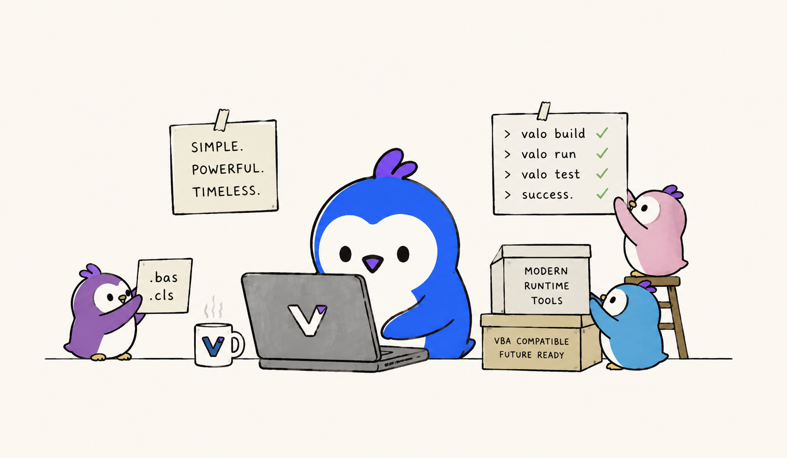

<div align="center">

  

  # The Valo Programming Language

  A modern Basic-inspired language and runtime with first-class VBA compatibility

</div>

<p align="center">
  <a href="#what-is-valo">What is Valo?</a> |
  <a href="#why-build-valo">Why?</a> |
  <a href="#language-goals">Goals</a> |
  <a href="#project-status">Status</a> |
  <a href="#getting-started">Getting started</a> |
  <a href="#vba-compatibility">VBA compatibility</a> |
  <a href="#documentation">Documentation</a> |
  <a href="#contributing">Contributing</a>
</p>

<p align="center">
  <a href="https://github.com/valolang/valo/actions/workflows/ci.yml">
    
  </a>
  <a href="https://github.com/valolang/valo/actions/workflows/release.yml">
    
  </a>
  <a href="https://github.com/valolang/valo/releases">
    
  </a>
  <a href="https://github.com/valolang/valo/blob/main/LICENSE">
    
  </a>
  
  
</p>

> [!NOTE]
> Valo is experimental and not production-ready yet. APIs, syntax, runtime behavior, and compatibility details may change quickly.

## What is Valo?

**Valo** is a modern Basic-inspired programming language and runtime built in Rust.

The original idea behind Valo was simple:

> What if VBA had its own Node.js moment?

JavaScript was once mostly tied to the browser. Node.js made it possible to use JavaScript almost anywhere: servers, CLIs, automation, tooling, desktop workflows, build systems, and more.

Valo explores a similar direction for VBA-style programming.

It is designed as a standalone evolution path for Basic/VBA-style development: familiar enough for VBA, VB6, and Visual Basic developers, but with modern language features, a clean runtime, professional diagnostics, modules, FFI, a REPL, project entrypoint discovery, and a growing standard runtime surface.

Valo supports two complementary modes:

| Mode | Purpose |
|---|---|
| `.valo` | Native Valo syntax for modern Basic-style development |
| `.bas` / `.cls` | VBA compatibility mode for migrating existing modules and classes |

Valo is not tied to Office or the VBA editor. It is a standalone runtime designed to modernize Basic-style development while remaining highly compatible with real-world VBA codebases.

## Why build Valo?



VBA remains one of the most productive programming environments ever shipped. It is simple, readable, approachable, and deeply useful for automation and business logic.

But VBA is also trapped inside a legacy ecosystem:

- tied to Office and COM
- difficult to package and distribute
- missing modern tooling
- missing a standalone runtime
- lacking modern diagnostics and project structure
- hard to evolve without breaking decades of assumptions

Valo takes a successor-language approach.

Instead of trying to clone VBA forever, Valo provides:

- a modern native language mode
- a compatibility bridge for existing `.bas` and `.cls` code
- a standalone runtime written in Rust
- a path toward modern tooling, packages, REPL workflows, FFI, and future compiled targets

This is similar in spirit to successor language projects:

- JavaScript → TypeScript
- Java → Kotlin
- C++ → Carbon
- VBA → **Valo**

Valo keeps the productivity and readability of Basic-style languages while building a runtime that can grow beyond the limitations of the original VBA environment.

The long-term goal is simple:

> Take the productivity of VBA out of Office and let it run anywhere.

## Language goals

Valo is designed around the following goals:

- Familiar Basic-style syntax for developers coming from VBA, VB6, or VB.NET
- First-class VBA compatibility for `.bas` and `.cls` migration
- Modern native syntax for new `.valo` projects
- Standalone runtime independent of the VBA editor
- Professional diagnostics with explicit diagnostic codes and source spans
- Modular project structure with imports and qualified symbols
- Strong runtime foundations for arrays, objects, variants, errors, structures, classes, and native types
- Experimental native interop through VBA-style `Declare`, `PtrSafe`, `LongPtr`, callbacks, `AddressOf`, and related APIs
- A practical migration path from legacy automation code to a modern runtime
- A clean implementation architecture suitable for future tooling and VM/compiler backends

Valo is still experimental, but its direction is clear: a modern Basic-family language with compatibility as a bridge, not a cage.

## Project status

Valo is currently an experimental language/runtime in active development.

It already includes:

- a parser and semantic validator
- a tree-walking interpreter
- modules, imports, namespaces, and VB.NET-style `Module ... End Module` blocks
- classes, interfaces, inheritance, structures, properties, events, and lifecycle hooks
- generics for classes, structures, functions, and methods, including nested generic type names
- parser support for VB.NET-style generic variance and constraint syntax
- native `Structure` value types and classic VBA `Type`
- lambdas, extension methods, operator overloading, partial classes, iterators, nullable types, and collection initializers
- `Option Explicit`, `Option Base`, `Option Compare`, and conditional compilation
- deterministic cleanup and `Using`
- VBA-compatible error handling
- a diagnostics engine
- a REPL and CLI
- native FFI support through `Declare`, `PtrSafe`, callbacks, and pointer helpers
- Windows COM/OLE Automation support through late-bound `Object`, `CreateObject`, and default-property dispatch
- VBA compatibility runtime features, including string/date/time/file helpers and classic file-number I/O
- cross-platform release packaging

Valo is not yet a full production compiler. There is currently no bytecode VM, package manager, formatter, or complete standard library. Some compatibility features are intentionally pragmatic and still evolving.

## Native Valo and VBA compatibility

Valo intentionally separates modern native syntax from compatibility syntax.

### Native Valo

Native `.valo` files use clean, modern Basic-style syntax:

```vb
Class Box(Of T)
    Public Value As T
End Class

Sub Main()
    Dim message As New Box(Of String)

    message.Value = "Hello, Valo"

    Console.WriteLine(message.Value)
End Sub
```

### VBA compatibility

VBA `.bas` and `.cls` files can use compatibility syntax:

```vb
Attribute VB_Name = "Module1"
Option Explicit

Sub Main()
    Debug.Print "Hello from VBA compatibility mode"
End Sub
```

The goal is not to force modern Valo code to use legacy metadata. Instead, Valo accepts VBA metadata where needed for migration while offering cleaner syntax for new code.

For more examples:

- [Examples](examples/README.md)
- [Language docs](docs/language)

## Feature highlights

### Modern control flow

```vb
Try
    DangerousOperation()
Catch ex As Error
    Console.WriteLine(ex.Message)
Finally
    Console.WriteLine("cleanup")
End Try
```

### COM Automation

On Windows, Valo supports late-bound COM/OLE Automation through `Object`, `CreateObject`, property access, method calls, and default-property syntax. This allows common VBA automation patterns such as `dict("Key")` for `Scripting.Dictionary`.

COM examples are Windows-only. On non-Windows hosts, `CreateObject` reports a clear runtime diagnostic.

```vb
Sub Main()
    Dim dict As Object
    Set dict = CreateObject("Scripting.Dictionary")
    
    ' Using default property Item (dict("Key") is same as dict.Item("Key"))
    dict("Name") = "Valo"
    
    Console.WriteLine("Dictionary name: " & dict("Name"))
End Sub
```

### VB.NET-style modules

```vb
Module MathTools
    Public Function Add(ByVal left As Integer, ByVal right As Integer) As Integer
        Add = left + right
    End Function
End Module

Sub Main()
    Console.WriteLine(MathTools.Add(2, 3))
End Sub
```

`Module ... End Module` blocks act as module-level declaration containers. Callable members and fields can also be accessed through the module block name.

### Namespaces

```vb
Namespace Game
Namespace Graphics

Public Class Sprite
End Class

End Namespace
End Namespace
```

Nested namespace wrappers are flattened into a qualified namespace such as `Game.Graphics`.

### VBA-style error handling

```vb
Sub Main()
    On Error GoTo Handler

    Err.Raise 1001, "Example", "Something failed"

    Exit Sub

Handler:
    Debug.Print Err.Description
    Resume Next
End Sub
```

### Generics, constraints, and inheritance

```vb
Class Box(Of T)
    Public Value As T
End Class

Interface IProducer(Of Out T)
    Function Current() As T
End Interface

Class Repository(Of T As {Class, New})
    Public Current As T
End Class
```

Generic type substitution is active for classes, structures, fields, parameters, properties, return values, inheritance, and nested generic instances. Constraint and variance syntax is accepted by the parser; deeper compile-time constraint enforcement is still being expanded.

### Native FFI

```vb
Declare PtrSafe Function strlen Lib "libc" CDecl (
    ByVal value As String
) As Long

Sub Main()
    Debug.Print strlen("Valo")
End Sub
```

Additional examples are available in the `examples/` directory.

### More language features

Valo also includes examples and tests for:

- `AndAlso` / `OrElse` short-circuiting
- nullable `T?` values with `.HasValue` and `.Value`
- native and VBA-style default properties
- static local variables
- multidimensional arrays and `ReDim Preserve`
- collection initializers and fluent LINQ-style extension APIs
- async declaration syntax and immediate interpreter `Await` evaluation
- `#If`, `#Const`, `Option Base`, and `Option Compare`

## Supported file types

| Extension | Mode | Purpose |
|---|---|---|
| `.valo` | Native Valo | Modern Basic-inspired development |
| `.bas` | VBA module compatibility | Legacy standard modules |
| `.cls` | VBA class compatibility | Exported class modules |

## CLI

Valo ships with a command-line interface for running, checking, and experimenting with code.

```sh
valo run examples/hello.valo
valo check examples/generic_box.valo
valo repl
valo version
valo help
```

### Run a file

```sh
valo run examples/hello.valo
```

### Check a file

```sh
valo check examples/modules/main.valo
```

### Start the REPL

```sh
valo repl
```

```txt
valo> Dim x As Integer
valo> x = 10
valo> Console.WriteLine(x)
10
```

## Getting started

Valo is currently experimental. You can build from source, or use release assets when they are available for your platform.

### Install via script

Linux and macOS:

```sh
curl -fsSL https://raw.githubusercontent.com/valolang/valo/main/scripts/install.sh | bash
```

Windows (PowerShell):

```powershell
iwr -UseBasicParsing https://raw.githubusercontent.com/valolang/valo/main/scripts/install.ps1 | iex
```

After installation, restart your terminal to apply PATH changes.

Verify:

```sh
valo version
valo help
```

### Manual download

Releases:

```txt
https://github.com/valolang/valo/releases
```

Available release assets may include:

| Platform | Asset |
|---|---|
| Linux x64 | `valo-linux-x64.tar.gz` |
| Linux x86 | `valo-linux-x86.tar.gz` |
| macOS ARM64 | `valo-macos-arm64.tar.gz` |
| macOS x64 | `valo-macos-x64.tar.gz` |
| Windows x64 | `valo-windows-x64.zip` |
| Windows x86 | `valo-windows-x86.zip` |

Windows example:

```powershell
.\valo.exe version
.\valo.exe run examples\hello.valo
```

### Build from source

Requirements:

- Rust stable

```sh
git clone https://github.com/valolang/valo
cd valo
cargo build --release
```

Run the CLI:

```sh
./target/release/valo version
```

Windows:

```powershell
.\target\release\valo.exe version
```

### Quality checks

```sh
cargo fmt --check
cargo clippy --workspace --all-targets -- -D warnings
cargo test
cargo test -p valo_core --test examples -- --nocapture
cargo build --release
```

## Your first Valo program

Create `hello.valo`:

```vb
Sub Main()
    Console.WriteLine("Hello, Valo")
End Sub
```

Run it:

```sh
valo run hello.valo
```

Output:

```txt
Hello, Valo
```

## Diagnostics

Valo includes professional diagnostics with:

- explicit diagnostic codes
- source spans
- suggestions
- stack traces
- import-cycle diagnostics
- semantic/member suggestions

Example:

```txt
error[V1100]: Cannot assign String value to Integer variable
 --> examples/demo.valo:4:9
  |
4 |     age = "twenty"
  |         ^^^^^^^^^ expected Integer
```

Diagnostics are designed to be actionable, stable, and suitable for future tooling.

## VBA compatibility

Valo supports a growing set of VBA-compatible features.

Currently supported areas include:

- `.bas` and `.cls` parsing
- exported class modules
- `Attribute VB_Name`
- `Attribute VB_UserMemId`
- classic function assignment semantics
- `On Error`
- `Err`
- `Resume`
- `Erl`
- `Debug.Print`
- `Declare`, `PtrSafe`, `LongPtr`
- `AddressOf`
- `VarPtr`, `StrPtr`, `ObjPtr`
- `Variant`, `Object`, `Empty`, `Null`
- Windows COM/OLE Automation through `CreateObject`, late-bound calls/properties, and default-property syntax
- file I/O compatibility runtime
- `Dir`, `EOF`, `LOF`, `FreeFile`
- `FileLen`, `FileDateTime`, `CurDir`, `MkDir`, `RmDir`, `ChDir`
- `Timer`, `Now`, `DateSerial`, `TimeSerial`, `DateValue`, `TimeValue`, `Year`, `Month`, `Day`, `Hour`, `Minute`, `Second`, `Weekday`, `MonthName`, `WeekdayName`
- string/runtime helpers such as `Len`, `LenB`, `Left$`, `Right$`, `Mid$`, `Trim$`, `Replace`, `InStr`, `InStrRev`, `Chr$`, `Asc`, `Hex$`, `Oct$`, `Val`, `Str`, `IsArray`, `IsNumeric`, `IsDate`, `VarType`, and `TypeName`
- `Input #`, `Line Input #`
- `Print #`, `Write #`
- `Get #`, `Put #`
- Random/Binary file modes
- automatic sibling loading for imported `.bas` / `.cls` compatibility modules

Compatibility is pragmatic and growing.

Valo already supports a substantial VBA compatibility surface, including `.bas` / `.cls` modules, classic runtime behavior, COM automation foundations on Windows, and native interop primitives.

Experimental native FFI is supported through VBA-style `Declare`, `PtrSafe`, `LongPtr`, `AddressOf`, callbacks, and platform-aware library loading. Broader Office object-model coverage and type-library tooling are future directions.

## Research directory

The `research/` directory contains real-world VBA/VB-style modules, parser edge cases, runtime stress tests, FFI demos, interoperability experiments, and prototypes used during Valo development.

These files are used to:

- validate VBA compatibility
- reproduce parser/runtime bugs
- stress the interpreter and FFI layer
- benchmark performance
- explore future language features
- prototype APIs and module-system behavior

Files in this directory are experimental and may change frequently as the language evolves.

## Documentation

Start here:

- [Getting started](docs/getting-started.md)
- [Language syntax](docs/language/syntax.md)
- [Expressions](docs/language/expressions.md)
- [Classes and objects](docs/language/classes.md)
- [Inheritance](docs/language/inheritance.md)
- [Generics](docs/language/generics.md)
- [Modules and imports](docs/language/modules.md)
- [Error handling](docs/language/error-handling.md)
- [Types](docs/language/types.md)
- [VBA compatibility](docs/language/vba-compat.md)
- [FFI](docs/language/ffi.md)
- [REPL](docs/repl.md)
- [Examples](examples/README.md)

Architecture docs:

- [Frontend](docs/architecture/frontend.md)
- [Backend](docs/architecture/backend.md)
- [Runtime](docs/architecture/runtime.md)
- [Parser](docs/architecture/parser.md)
- [Diagnostics](docs/architecture/diagnostics.md)
- [Module System](docs/architecture/modules.md)
- [Platform](docs/architecture/platform.md)
- [Roadmap](docs/architecture/roadmap.md)

## Contributing

Valo is in active development.

Good areas to contribute:

- language tests
- VBA compatibility cases
- documentation
- examples
- diagnostics
- runtime builtins
- CLI and REPL improvements
- import-system design
- real-world `.bas` / `.cls` compatibility cases

Before submitting changes, run:

```sh
cargo fmt --check
cargo clippy --workspace --all-targets -- -D warnings
cargo test
cargo test -p valo_core --test examples -- --nocapture
cargo build --release
```

See [CONTRIBUTING.md](CONTRIBUTING.md) for more information.

## License

Valo is licensed under the [MIT License](LICENSE).
